# Glen paints
# - a full stack e-commerce web application

------
## About and purpose 

This e-commerce website was built for professional artist and photographer, Glen Beckford, as my final Milestone Project for the Code Institute Web development diploma.
My father, Glen, produces original artwork, so for this project I am building him an e-commerce platform for his shop so he can sell his artwork online.
Through this site he can share his passion for creating and designing, demonstrating his talents as a painter and photographer, and so the website has future scope to help streamline any of his freelance services .

----------------------------

## UX:
## Strategy
### Target Audience

 1. People interested in buying original paint or photography pieces for themselves or others.
 2. People hoping to browse Glens collection of artwork
 3. People who want to learn more about Glen as an artist

### User Requirements and Expectations

 1. Simple user interface that’s easy to navigate
 2. Display all important info in a clear way 
 3. Functioning navigation system 
 4. Leave a review of artwork 
 5. Make secure purchase 
 6. Find info on frequently asked questions

### How the shop fulfils these expectations:**

 1. Attractive website design that falls in line with art style 
 2. Meet accessibility needs
 3. Typical shop features (menu, checkout, info page, etc.)
 4. Filtered search option
 5. Secure profile creation
 6. Confirmation/error pages

## User Stories

### User

- ### First time user goals 

    1. As a first time User, I want to easily register for an account 
    2. As a first time user, I want to navigate the website easily to find what's available.
    3. As a first time User, I want to know about the artist being what's being sold
    4. As a first time User, I want to easily add products to my bag 
    5. As a first time User, I want easily pay for my items 

- ### Returning time user goals 

    1. As a Returning User, I want log in easily and view my purchase history.
    2. As a Returning User, I would like to sort products by various criteria

- ### Frequent time user goals 

    1. As a frequent User, I would like my personal details saved on my account for an easier checkout process
    2. As a frequent User, I want a way to get in contact with the seller 
    3. As a frequent User, I want to easily see any answers to questions I may have.

### Admin user or Site owner

- ### User goals

    1. As an Admin User, I would like to manage the product listings that are displayed on the site.
    2. As an Admin User, I would like access to editing or adding new products.
    3. As an Admin User, I would like the option to remove products.

## Design

### Colour Scheme

- #### [Coolers](https://coolors.co/) : Coolors has been used to help with the colour scheme for the project.

#### The main colours used in this website are:
#### 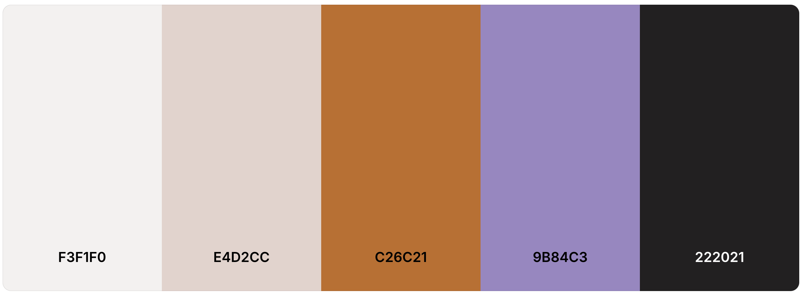

### Typography:
- #### The fonts use throughout this website are:
    - Google fonts 'Rubik Glitch' for the title of the website and 'Lexend Deca' for the rest of the text.

### Imagery

- #### All images are original paintings by Glen Beckford.

## Wireframes

### Home:

[Homepage_top](/docs/wireframes_home_top.png)
[Homepage_bottom](/docs/wireframes_home_bottom.png)

### Shop:

[shop](/docs/wireframes_shop.png)

### Item page:

[Item](/docs/wireframes_shop_item.png)

### FAQs:

[FAQs](/docs/wireframes_FAQs.png)

### Contact: 

[Contact](/docs/wireframes_contact.png)

### Basket:

[Basket](/docs/wireframes_basket.png)

### Account:

[Account_login](/docs/wireframes_login.png)
[Account_register](/docs/wireframes_register.png)

---

## Database Structure
### Diagram

- The diagram (created on DrawSQL) shows a layout of the tables created by my models in the database.

---

## Tools and Technologies Used:

### Languages:
- **HTML5**
- **CSS**
- **JavaScript**
- **Python3**

### Frameworks:
- [Django v3.2](https://www.djangoproject.com/)
- [Bootstrap](https://getbootstrap.com/docs/4.4/getting-started/introduction/) 

### Libraries:
- [JQuery](https://jquery.com/) 
- [Google Fonts](https://fonts.google.com/) 
- [FontAwesome](https://fontawesome.com/) 

### Packages:
- **asgiref** 
- **boto3** 
- **botocore** 
- **dj-database-url** 
- **django** 
- **django-allauth** 
- **django-countries** 
- **django-crispy-forms** 
- **django-storages**
- **gunicorn**
- **jmespath**
- **oauthlib**
- **pillow**
- **psycopg2**
- **python-dotenv**
- **python3-openid**
- **pytz**
- **requests-oauthlib**
- **s3transfer**
- **sqlparse**
- **stripe**

---

## Features

### All pages:
- Nav: 

 1. Nav (large view) includes clickable logo to take user back to home screen, Link to basket, link to account options, and home/shop/FAQs/contact navigation links. 
 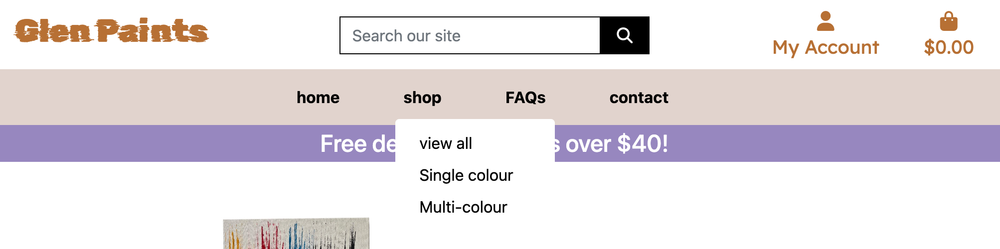
 2. Nav (mobile view)
 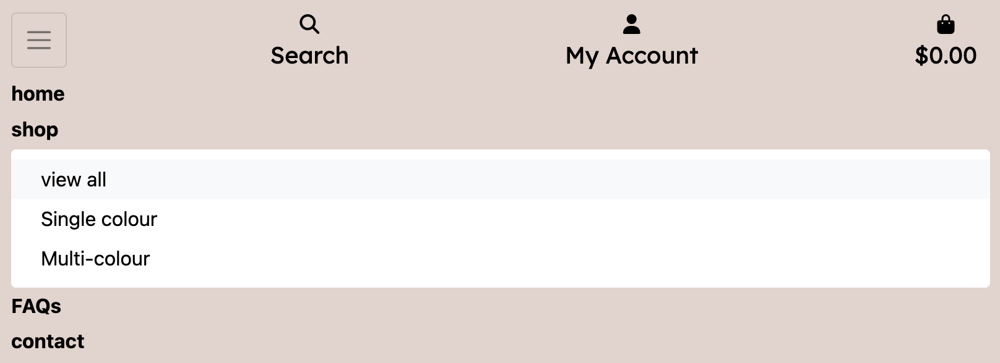
 3. Search bar for shop items
 
 4. The 'my account' dropdown options adjust depending on user context
    - Login options
    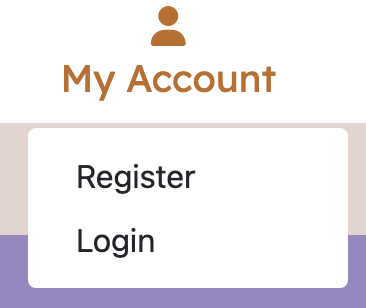
    - Logged in user options
    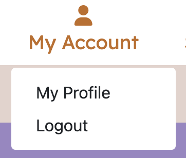
    - Admin options
    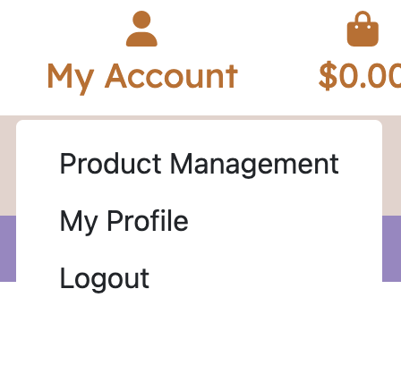
 5. Updated basket info 
 - 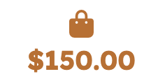
 6. Discount info 

- Footer:

 1. Navigation links to shop, faqs and contact
 2. Links to social media 
 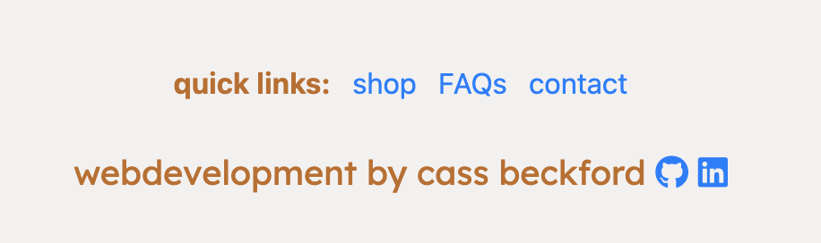

### Home:

 1. Short ‘about’ section talking about the artist with links to social media.
 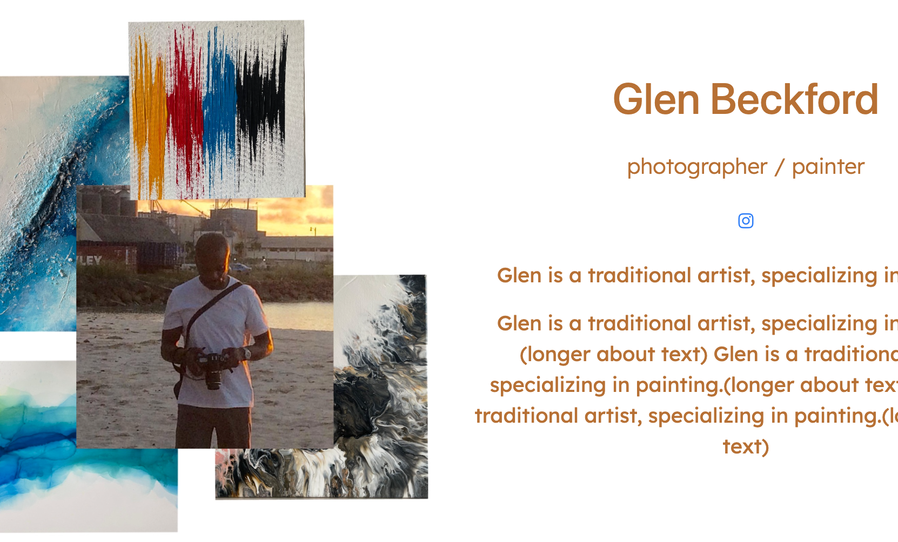
 2. Info on what’s being sold - links to ‘shop’ section
 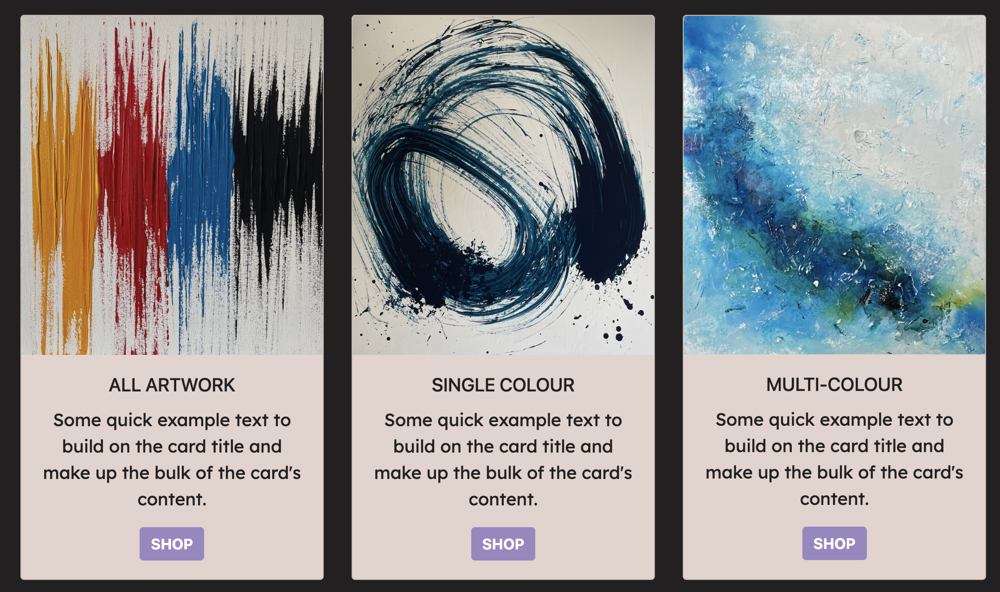

### Shop:

 1. Shop page includes: dropdown menu with filters, number of items and products.
 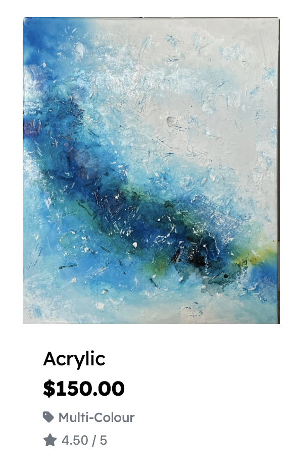
 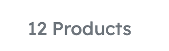
 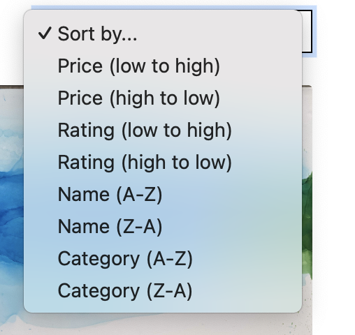
### Item page:

 1. Image of product chosen 
 2. Includes name, price and description
 3. option to adjust quantity and add to bag option
 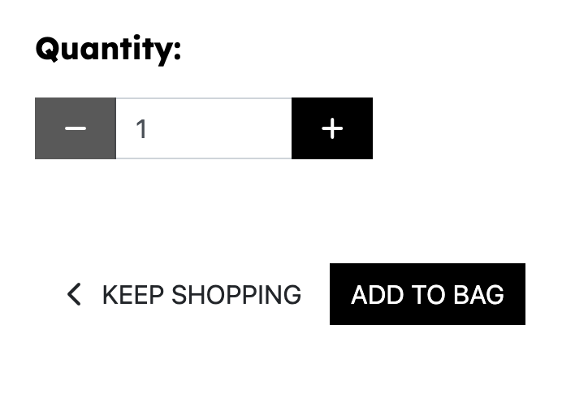

### FAQs:

 1. Frequently asked questions accordian.
 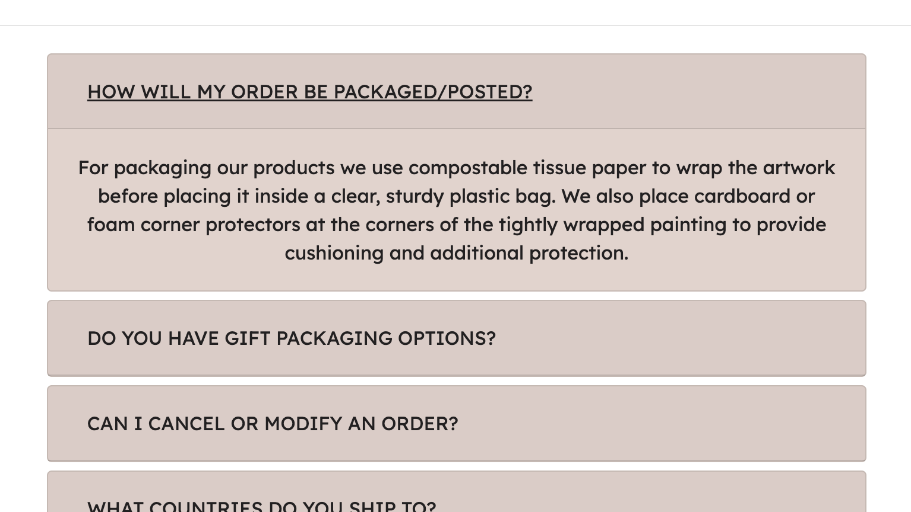

### Contact: 

 1. Get in contact form
 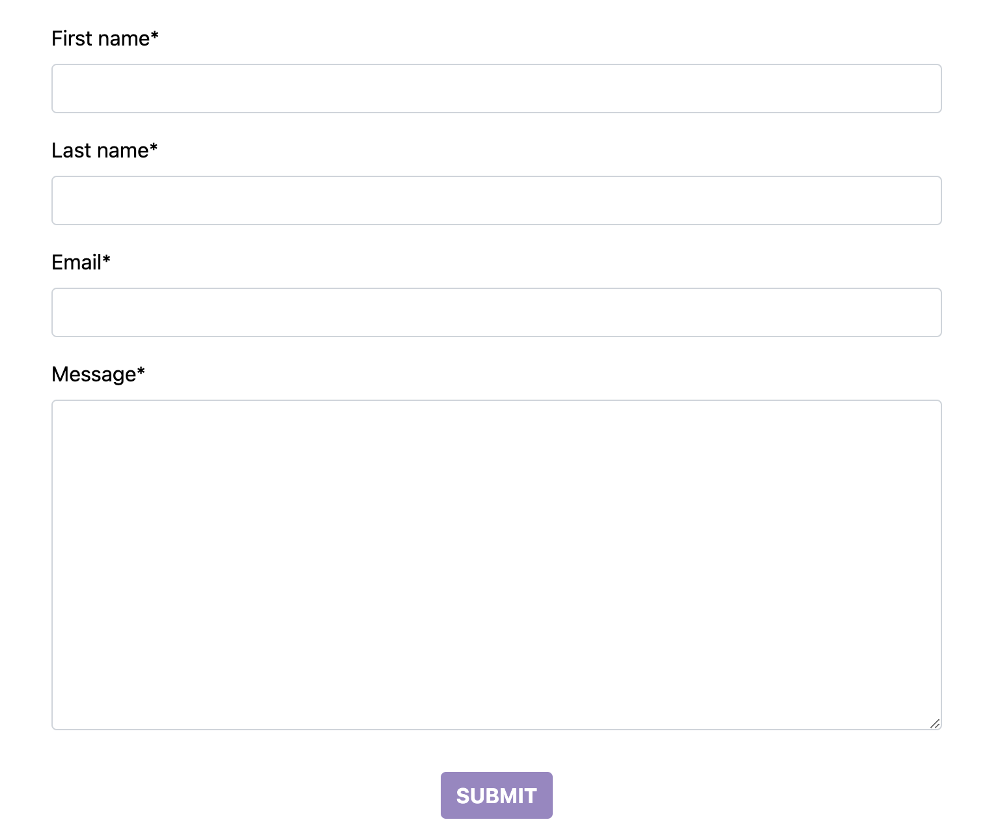

### Basket:

 1. All products a user has added to their cart including a final price 
 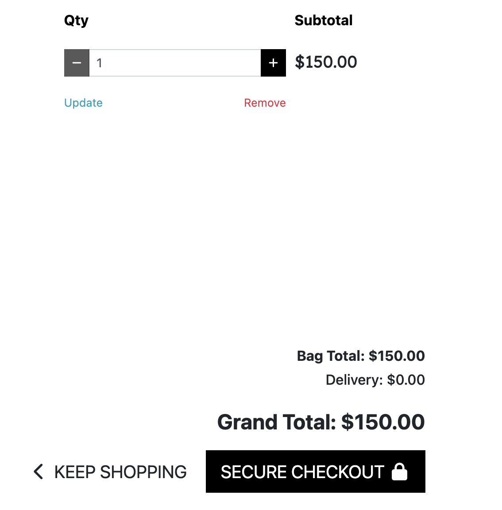
 2. Users can go to the checkout page using the 'secure checkout' button on the basket page or on the toast that appears immediately after adding an item to the bag
 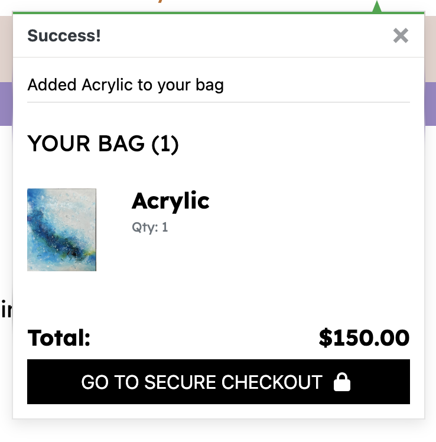

### Checkout:

 1. Includes a checkout form for adding delivery and payment info 
 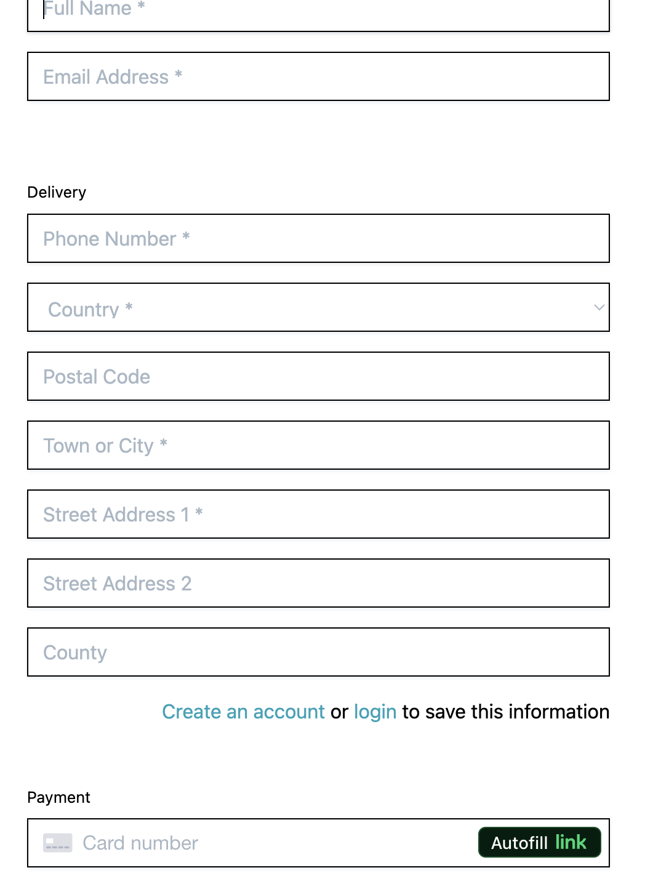

### Account:

 1. Sign in - Users can input their sign in info or the option to register an account if they don't have one already.
 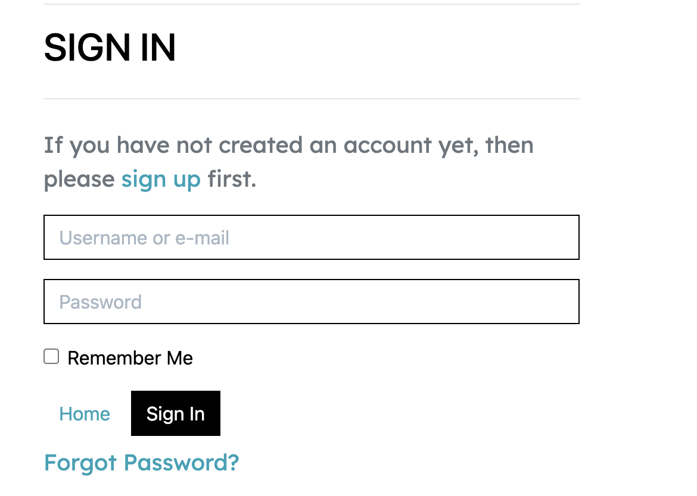

 2. Register - Users can create an account using their email and create a password.
 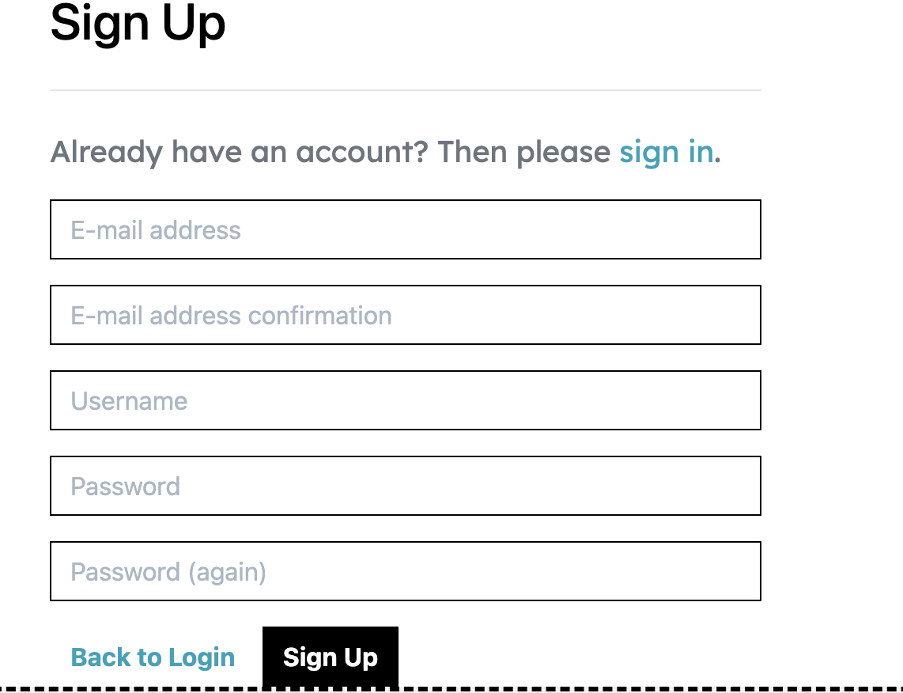

 ---

