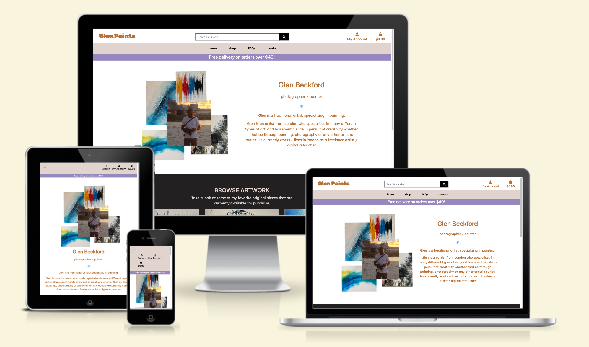
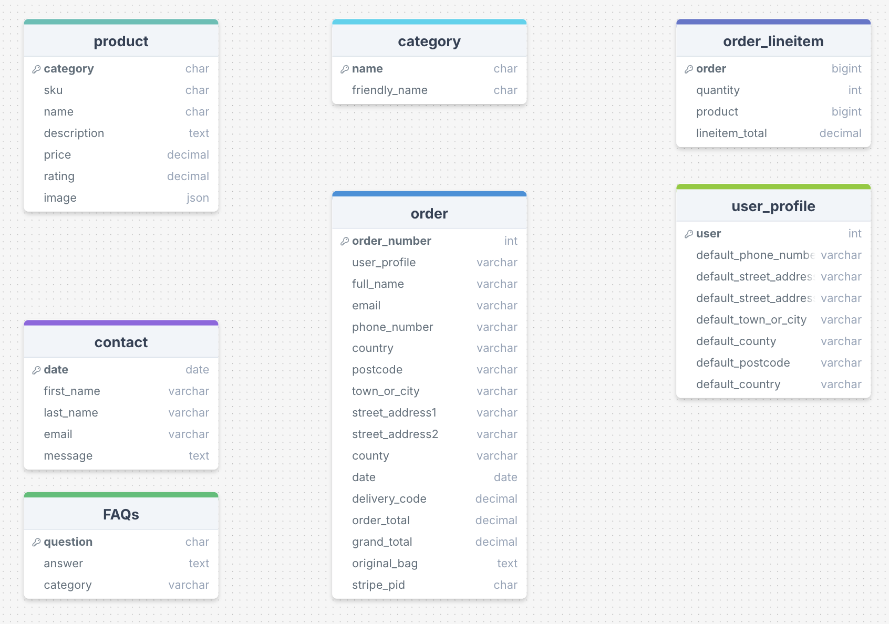
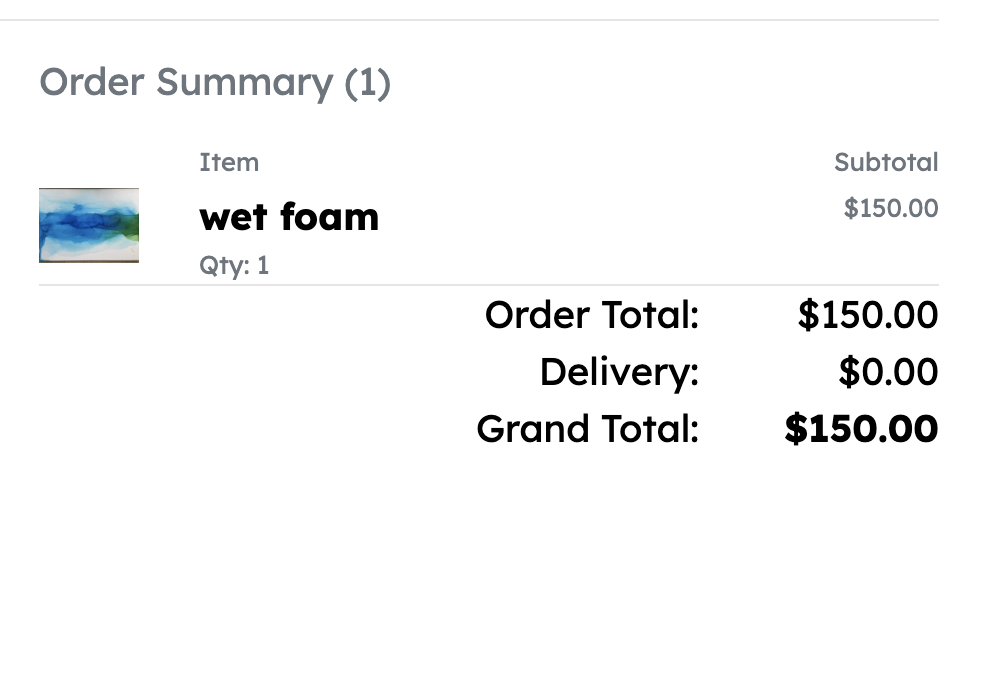
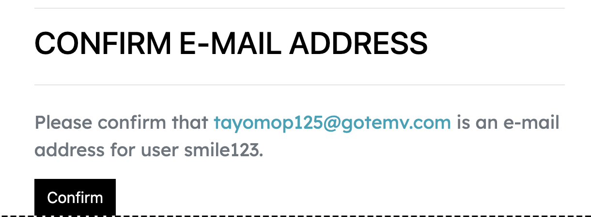
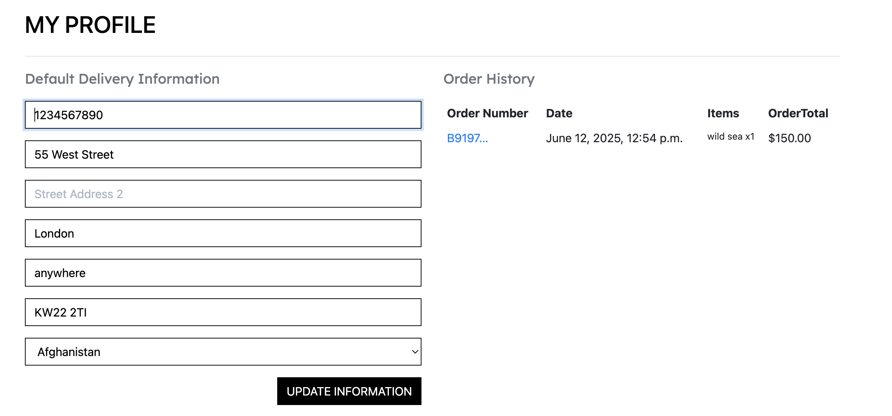

# Glen paints
# - a full stack e-commerce web application

## [Click Here To View The Live Project](https://glens-paintings-0a22e43e4b5d.herokuapp.com/)

## 

------
## About and purpose 

This e-commerce website was built for professional artist and photographer, Glen Beckford, as my final Milestone Project for the Code Institute Web development diploma.
My father, Glen, produces original artwork, so for this project I am building him an e-commerce platform for his shop so he can sell his artwork online.
Through this site he can share his passion for creating and designing, demonstrating his talents as a painter and photographer, and so the website has future scope to help streamline any of his freelance services .

----------------------------

## Test card details (from Stripe):

- Card number: 4242 4242 4242 4242

- Expiry date: 04 / 245 (or any future date)

- CVC: 424 (example)

- ZIP: 42424

------

## UX:
## Strategy
### Target Audience

 1. People interested in buying original paint or photography pieces for themselves or others.
 2. People hoping to browse Glens collection of artwork
 3. People who want to learn more about Glen as an artist

### User Requirements and Expectations

 1. Simple user interface that’s easy to navigate
 2. Display all important info in a clear way 
 3. Functioning navigation system 
 4. Leave a review of artwork 
 5. Make secure purchase 
 6. Find info on frequently asked questions

### How the shop fulfils these expectations:**

 1. Attractive website design that falls in line with art style 
 2. Meet accessibility needs
 3. Typical shop features (menu, checkout, info page, etc.)
 4. Filtered search option
 5. Secure profile creation
 6. Confirmation/error pages

## User Stories

### User

- ### First time user goals 

    1. As a first time User, I want to easily register for an account 
    2. As a first time user, I want to navigate the website easily to find what's available.
    3. As a first time User, I want to know about the artist being what's being sold
    4. As a first time User, I want to easily add products to my bag 
    5. As a first time User, I want easily pay for my items 

- ### Returning time user goals 

    1. As a Returning User, I want log in easily and view my purchase history.
    2. As a Returning User, I would like to sort products by various criteria

- ### Frequent time user goals 

    1. As a frequent User, I would like my personal details saved on my account for an easier checkout process
    2. As a frequent User, I want a way to get in contact with the seller 
    3. As a frequent User, I want to easily see any answers to questions I may have.

### Admin user or Site owner

- ### User goals

    1. As an Admin User, I would like to manage the product listings that are displayed on the site.
    2. As an Admin User, I would like access to editing or adding new products.
    3. As an Admin User, I would like the option to remove products.

## Design

### Colour Scheme

- #### [Coolers](https://coolors.co/) : Coolors has been used to help with the colour scheme for the project.

#### The main colours used in this website are:
#### 

### Typography:
- #### The fonts use throughout this website are:
    - Google fonts 'Rubik Glitch' for the title of the website and 'Lexend Deca' for the rest of the text.

### Imagery

- #### All images are original paintings by Glen Beckford.

## Wireframes

### Home:

[Homepage_top](/docs/wireframes_home_top.png)
[Homepage_bottom](/docs/wireframes_home_bottom.png)

### Shop:

[shop](/docs/wireframes_shop.png)

### Item page:

[Item](/docs/wireframes_shop_item.png)

### FAQs:

[FAQs](/docs/wireframes_FAQs.png)

### Contact: 

[Contact](/docs/wireframes_contact.png)

### Basket:

[Basket](/docs/wireframes_basket.png)

### Account:

[Account_login](/docs/wireframes_login.png)
[Account_register](/docs/wireframes_register.png)

---

## Database Structure
### Diagram

- The diagram (created on DrawSQL) shows a layout of the tables created by my models in the database.


---

## Tools and Technologies Used:

### Languages:
- **HTML5**
- **CSS**
- **JavaScript**
- **Python3**

### Frameworks:
- [Django v3.2](https://www.djangoproject.com/)
- [Bootstrap](https://getbootstrap.com/docs/4.4/getting-started/introduction/) 

### Libraries:
- [JQuery](https://jquery.com/) 
- [Google Fonts](https://fonts.google.com/) 
- [FontAwesome](https://fontawesome.com/) 

### Packages:
- **asgiref** 
- **boto3** 
- **botocore** 
- **dj-database-url** 
- **django** 
- **django-allauth** 
- **django-countries** 
- **django-crispy-forms** 
- **django-storages**
- **gunicorn**
- **jmespath**
- **oauthlib**
- **pillow**
- **psycopg2**
- **python-dotenv**
- **python3-openid**
- **pytz**
- **requests-oauthlib**
- **s3transfer**
- **sqlparse**
- **stripe**

---

## Features

### All pages:
- Nav: 

 1. Nav (large view) includes clickable logo to take user back to home screen, Link to basket, link to account options, and home/shop/FAQs/contact navigation links. 
 
 2. Nav (mobile view)
 
 3. Search bar for shop items
 
 4. The 'my account' dropdown options adjust depending on user context
    - Login options
    
    - Logged in user options
    
    - Admin options
    
 5. Updated basket info 
 - 
 6. Discount info 

- Footer:

 1. Navigation links to shop, faqs and contact
 2. Links to social media 
 

### Home:

 1. Short ‘about’ section talking about the artist with links to social media.
 
 2. Info on what’s being sold - links to ‘shop’ section
 

### Shop:

 1. Shop page includes: dropdown menu with filters, number of items and products.
 
 
 
### Item page:

 1. Image of product chosen 
 2. Includes name, price and description
 3. option to adjust quantity and add to bag option
 

### FAQs:

 1. Frequently asked questions accordian.
 

### Contact: 

 1. Get in contact form
 

### Basket:

 1. All products a user has added to their cart including a final price 
 
 2. Users can go to the checkout page using the 'secure checkout' button on the basket page or on the toast that appears immediately after adding an item to the bag
 

### Checkout:

 1. Includes a checkout form for adding delivery and payment info 
 

 2. Includes items that are being ordered
  

### Account:

 1. Sign in - Users can input their sign in info or the option to register an account if they don't have one already.
 

 2. Register - Users can create an account using their email and create a password.
 

 3. Users registering for an account have to confirm their email.
  

 4. Users can see their personal info and past orders.
 

 ---
## Testing

For all testing, please refer to the [TESTING.md](TESTING.md) file.

 ---
## Deployment

### Amazon AWS

This project uses [AWS](https://aws.amazon.com) to store media and static files online, due to the fact that Heroku doesn't persist this type of data.

Once you've created an AWS account and logged-in, follow these series of steps to get your project connected.
Make sure you're on the **AWS Management Console** page.

#### S3 Bucket

- Search for **S3**.
- Create a new bucket, give it a name (matching your Heroku app name), and choose the region closest to you.
- Uncheck **Block all public access**, and acknowledge that the bucket will be public (required for it to work on Heroku).
- From **Object Ownership**, make sure to have **ACLs enabled**, and **Bucket owner preferred** selected.
- From the **Properties** tab, turn on static website hosting, and type `index.html` and `error.html` in their respective fields, then click **Save**.
- From the **Permissions** tab, paste in the following CORS configuration:

	```shell
	[
		{
			"AllowedHeaders": [
				"Authorization"
			],
			"AllowedMethods": [
				"GET"
			],
			"AllowedOrigins": [
				"*"
			],
			"ExposeHeaders": []
		}
	]
	```

- Copy your **ARN** string.
- From the **Bucket Policy** tab, select the **Policy Generator** link, and use the following steps:
	- Policy Type: **S3 Bucket Policy**
	- Effect: **Allow**
	- Principal: `*`
	- Actions: **GetObject**
	- Amazon Resource Name (ARN): **paste-your-ARN-here**
	- Click **Add Statement**
	- Click **Generate Policy**
	- Copy the entire Policy, and paste it into the **Bucket Policy Editor**

		```shell
		{
			"Id": "Policy1234567890",
			"Version": "2012-10-17",
			"Statement": [
				{
					"Sid": "Stmt1234567890",
					"Action": [
						"s3:GetObject"
					],
					"Effect": "Allow",
					"Resource": "arn:aws:s3:::your-bucket-name/*"
					"Principal": "*",
				}
			]
		}
		```

	- Before you click "Save", add `/*` to the end of the Resource key in the Bucket Policy Editor (like above).
	- Click **Save**.
- From the **Access Control List (ACL)** section, click "Edit" and enable **List** for **Everyone (public access)**, and accept the warning box.
	- If the edit button is disabled, you need to change the **Object Ownership** section above to **ACLs enabled** (mentioned above).

#### IAM

Back on the AWS Services Menu, search for and open **IAM** (Identity and Access Management).
Once on the IAM page, follow these steps:

- From **User Groups**, click **Create New Group**.
	- Suggested Name: (group_project_name)
- Tags are optional, but you must click it to get to the **review policy** page.
- From **User Groups**, select your newly created group, and go to the **Permissions** tab.
- Open the **Add Permissions** dropdown, and click **Attach Policies**.
- Select the policy, then click **Add Permissions** at the bottom when finished.
- From the **JSON** tab, select the **Import Managed Policy** link.
	- Search for **S3**, select the `AmazonS3FullAccess` policy, and then **Import**.
	- You'll need your ARN from the S3 Bucket copied again, which is pasted into "Resources" key on the Policy.

		```shell
		{
			"Version": "2012-10-17",
			"Statement": [
				{
					"Effect": "Allow",
					"Action": "s3:*",
					"Resource": [
						"arn:aws:s3:::your-bucket-name",
						"arn:aws:s3:::your-bucket-name/*"
					]
				}
			]
		}
		```
	
	- Click **Review Policy**.
	- Suggested Name: (policy_project_name)
	- Provide a description:
	- Click **Create Policy**.
- From **User Groups**, click your group.
- Click **Attach Policy**.
- Search for the policy you've just created and select it, then **Attach Policy**.
- From **User Groups**, click **Add User**.
	- Suggested Name: (user_project_name)
- For "Select AWS Access Type", select **Programmatic Access**.
- Select the group to add your new user to: (user_project_name)
- Tags are optional, but you must click it to get to the **review user** page.
- Click **Create User** once done.
- You should see a button to **Download .csv**, so click it to save a copy on your system.
	- **IMPORTANT**: once you pass this page, you cannot come back to download it again, so do it immediately!
	- This contains the user's **Access key ID** and **Secret access key**.
	- `AWS_ACCESS_KEY_ID` = **Access key ID**
	- `AWS_SECRET_ACCESS_KEY` = **Secret access key**

#### Final AWS Setup

- If Heroku Config Vars has `DISABLE_COLLECTSTATIC` still, this can be removed now, so that AWS will handle the static files.
- Back within **S3**, create a new folder called: `media`.
- Select any existing media images for your project to prepare them for being uploaded into the new folder.
- Under **Manage Public Permissions**, select **Grant public read access to this object(s)**.
- No further settings are required, so click **Upload**.

### Stripe API

This project uses [Stripe](https://stripe.com) to handle the ecommerce payments.

Once you've created a Stripe account and logged-in, follow these series of steps to get your project connected.

- From your Stripe dashboard, click to expand the "Get your test API keys".
- You'll have two keys here:
	- `STRIPE_PUBLIC_KEY` = Publishable Key (starts with **pk**)
	- `STRIPE_SECRET_KEY` = Secret Key (starts with **sk**)

As a backup, in case users prematurely close the purchase-order page during payment, we can include Stripe Webhooks.

- From your Stripe dashboard, click **Developers**, and select **Webhooks**.
- From there, click **Add Endpoint**.
- Click **receive all events**.
- Click **Add Endpoint** to complete the process.
- You'll have a new key here:
	- `STRIPE_WH_SECRET` = Signing Secret (Wehbook) Key (starts with **wh**)

### Gmail API

This project uses [Gmail](https://mail.google.com) to handle sending emails to users for account verification and purchase order confirmations.

Once you've created a Gmail (Google) account and logged-in, follow these series of steps to get your project connected.

- Click on the **Account Settings** (cog icon) in the top-right corner of Gmail.
- Click on the **Accounts and Import** tab.
- Within the section called "Change account settings", click on the link for **Other Google Account settings**.
- From this new page, select **Security** on the left.
- Select **2-Step Verification** to turn it on. (verify your password and account)
- Once verified, select **Turn On** for 2FA.
- Navigate back to the **Security** page, and you'll see a new option called **App passwords**.
- This might prompt you once again to confirm your password and account.
- Select **Mail** for the app type.
- Select **Other (Custom name)** for the device type.
	- Any custom name, such as "Django" or abundant-books-ms-4
- You'll be provided with a 16-character password (API key).
	- Save this somewhere locally, as you cannot access this key again later!
	- `EMAIL_HOST_PASS` = your new 16-character API key
	- `EMAIL_HOST_USER` = your own personal Gmail email address (`you@gmail.com`)

### Heroku Deployment

1. Dependencies first need to be installed to be able to use Postgres on the deployed site:

```
pip3 install dj_database_url
pip3 install psycopg2
```

2. Create a ``requirements.txt`` file and a ``Procfile``

3. Requirements.txt contains all the applications and dependencies needed to run the app.
4. The Procfile tells Heroku which files to run the app and how. Use this command to set up the Procfile:
```
web: gunicorn [your app name].wsgi:application

```
5. Delete any blank lines from the end of the Procfile created as this may cause errors. Commit and push these changes.
6. Create a new app on [Heroku](https://www.heroku.com/).
7. Connect the Heroku app to the Github project repository.
8. You will need to provide Heroku with the configuration variables to build the app successfully.

Keys and their values:
```
AWS_ACCESS_KEY_ID = from AWS setup
AWS_SECRET_ACCESS_KEY = from AWS setup
DATABASE_URL = from Supabase
EMAIL_HOST_PASS = from email server setup
EMAIL_HOST_USER = from email server setup
SECRET_KEY = insert value here
STRIPE_PUBLIC_KEY = from Stripe setup
STRIPE_SECRET_KEY = from Stripe setup
STRIPE_WH_SECRET = from Stripe setup
USE_AWS = True

```

9. Then add the hostname of the Heroku app to ALLOWED_HOSTS in settings.py of the main django project app.

## Credits

###  Code

   -   [Code Institute](https://codeinstitute.net/): Code Institutes lessons have help with all coding throughout this project.

   -   [Code Institute Sample README.md](https://github.com/Code-Institute-Solutions/SampleREADME): Code Institute Sample README.md has been used to help with readme layout.

   -   [Bootstrap5](https://getbootstrap.com/docs/5.4/getting-started/introduction/): Bootstrap Library used throughout the project mainly to make site responsive using the    Bootstrap Grid System.

   -   [W3 Schools](https://www.w3schools.com/): W3 Schools has been used with some elements in this project.

### Acknowledgments

	- Special thanks to my Tutor- Miguel & Mentor- Moritz for their help and guidance throughout this project.


