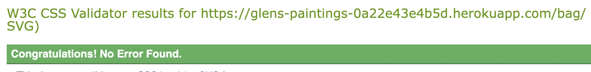

### HTML

I have used the [HTML W3C Validator](https://validator.w3.org) to validate all of my HTML files.

| Page | Screenshot | Notes | |
| --- | --- | --- | --- |
| Home |  | Pass: No Errors|
| Products |  | Pass: No Errors |
| Product Detail |  | Pass: No Errors|
| Product Edit |  | Pass: No Errors |
| Product Add |  | Pass: No Errors |
| FAQs |  | Pass: No Errors|
| Contact |  | Pass: No Errors |
| Bag |  | Pass: No Errors |
| Checkout |  | Pass: No Errors |
| Checkout Success |  | Pass: No Errors |

### CSS

I have used the [CSS Jigsaw Validator](https://jigsaw.w3.org/css-validator/) to validate all of my CSS files.

| Page | Screenshot | Notes | |
| --- | --- | --- | --- |
| Home |  | Pass: No Errors|
| Products |  | Pass: No Errors |
| FAQs |  | Pass: No Errors|
| Contact |  | Pass: No Errors |
| Bag |  | Pass: No Errors |
| Checkout |  | Pass: No Errors |

### PYTHON

I have used the recommended [PEP8 CI Python Linter](https://pep8ci.herokuapp.com) to validate all of my Python files.

| File |  | Screenshot |  |
| --- | --- | --- | --- |
| Bag urls.py |  |
| Bag views.py |  |
| Bag contexts.py |  |
| Checkout admin.py |  |
| Checkout forms.py |  |
| Checkout models.py |  |
| Checkout urls.py |  |
| Checkout views.py |  |
| Checkout webhook_handler.py |  |
| Checkout webhooks.py |  |
| FAQs admin.py |  |
| FAQs models.py |  |
| FAQs urls.py |  |
| FAQs views.py |  |
| Home urls.py |  |
| Home views.py |  |
| glen_paints settings.py |  |
| glen_paints urls.py |  |
| Products admin.py |  |
| Products forms.py |  |
| Products models.py |  |
| Products urls.py |  |
| Products views.py |  |
| Profiles forms.py |  |
| Profiles models.py |  |
| Profiles urls.py |  |
| Profiles views.py |  |
| Contact forms.py |  |
| Contact models.py |  |
| Contact urls.py |  |
| Contact views.py |  |

### Manual Testing 

| **Page**        | **Testing**                                                      | **Outcome** |
| --------------- | :--------------------------------------------------------------: | ---:|
|NAV              | Title of webpage leads back to home page                         | YES|
|NAV              | Search bar returns users query                                   | YES|
|NAV              | Account button allows users to login or register                 | YES|
|NAV              | Account dropdown options change depending on user context        | YES|
|NAV              | Bag button takes user to their bag                               | YES|
|NAV              | Bag button displays current amount in basket                     | YES|
|NAV              | Home/shop/faqs/contact buttons navigate to correct page          | YES|
|HOME PAGE        | Social media links are functional                                | YES|
|HOME PAGE        |  Browse artwork shop buttons all navigate to correct pae         | YES|
|PRODUCTS         | Filter button adjusts how products are displayed                 | YES|
|PRODUCTS(ADMIN)  | Users can edit or delete items                                   | YES|
|PRODUCTS(DETAIL) | Can adjust quantity of item                                      | YES|
|PRODUCTS(DETAIL) | Can add to bag or navigate back to products page                 | YES|
|FAQS             | Accordion works                                                  | YES|
|BAG              | Users can adjust the quantity of products                        | YES|
|BAG              | Users can navigate to secure checkout                            | YES|
|CHECKOUT         | Users used saved info to autofill detail                         | YES|
|CONTACT          | Submit button activates success toast                            | YES|
|ACCOUNT          | Users receive verification email after signing up                | YES|
|ACCOUNT          | Users can logout using logout button                             | YES|
|ACCOUNT          | Users can see account info and past orders                       | YES|

## Further Testing

This website was tested on:

- Google Chrome, Firefox, Microsoft Edge and Safari.
- Testing has been done to ensure all elements were linking correctly.

## Bugs

Faqs.css not linking up properly to deployed site. 
